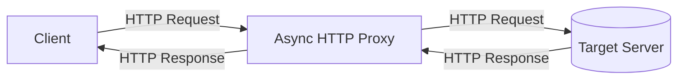

***

# Асинхронный HTTP-прокси сервер

Реализация однопоточного асинхронного HTTP-прокси сервера на C++20 с использованием библиотеки Boost.Asio.

Проект представляет собой приложение, которое принимает HTTP-соединения, извлекает из запроса целевой хост, устанавливает с ним соединение и ретранслирует данные между клиентом и целевым сервером. Вся обработка сетевых операций выполняется асинхронно в одном потоке.

- [Архитектура и реализация](#архитектура-и-реализация)
- [UML диаграммы](#uml-диаграммы)
- [Используемые технологии](#используемые-технологии)
- [Начало работы](#начало-работы)
- [Сборка проекта](#сборка-проекта)
- [Использование](#использование)
  - [Запуск сервера](#запуск-сервера)
  - [Пример использования с wget](#пример-использования-с-wget)
  - [Пример использования с nc и wget](#пример-использования-с-nc-и-wget)
- [Тестирование](#тестирование)
  - [Запуск всех тестов](#запуск-всех-тестов)
  - [Модульные тесты (GTest)](#модульные-тесты-gtest)
  - [Интеграционные тесты (Pytest)](#интеграционные-тесты-pytest)


## Архитектура и реализация

*   **Однопоточная модель**: Сервер функционирует в одном потоке управления. Для обработки множественных одновременных соединений используется кооперативная многозадачность, реализованная через сопрограммы (корутины) C++20. Это исключает состояние гонки (race conditions) и необходимость использования примитивов синхронизации. Интеграционный тест `test_single_threaded_execution` верифицирует, что идентификатор потока обработки сессии совпадает с PID процесса.

*   **Асинхронные операции ввода-вывода**: Все сетевые операции (принятие соединений, чтение, запись, разрешение имен) реализованы с помощью `boost::asio::co_spawn` и `boost::asio::use_awaitable`. Это позволяет приостанавливать выполнение сопрограммы `session` на время ожидания I/O операции, не блокируя основной поток.

*   **Обработка сессии (`session`)**: Каждое новое клиентское соединение обрабатывается в отдельном экземпляре сопрограммы `session`. Жизненный цикл сессии включает следующие этапы:
    1.  Асинхронное чтение HTTP-заголовков от клиента с помощью `async_read_until` до разделителя `\r\n\r\n`. Установлен лимит на максимальный размер заголовков (`MAX_HEADERS_SIZE`).
    2.  Парсинг заголовков для извлечения значения поля `Host` функцией `findHostPort`.
    3.  Асинхронное разрешение доменного имени и установка TCP-соединения с целевым сервером.
    4.  Пересылка исходного клиентского запроса целевому серверу.
    5.  Асинхронное чтение заголовков ответа от сервера до `\r\n\r\n`.
    6.  Парсинг заголовков ответа для извлечения `Content-Length` (если присутствует) функцией `findContentLength`.
    7.  Немедленная пересылка заголовков ответа клиенту.
    8.  Потоковая передача тела ответа: данные читаются от сервера в буфер фиксированного размера и немедленно записываются клиенту до тех пор, пока сервер не закроет соединение (`eof`) или не будет прочитано `Content-Length` байт.

*   **Парсинг HTTP-заголовков**: Реализован набор функций (`iterHeaders`, `findHostPort`, `findContentLength`), для итерации по заголовкам без выделения дополнительной памяти и копирования данных.

*   **Обработка ошибок**: Исключения, возникающие в процессе сессии (например, невозможность подключиться к хосту), перехватываются в `try/catch` блоке внутри сопрограммы `session`. Клиенту в этом случае отправляется ответ `HTTP/1.1 502 Bad Gateway`. Соединение с клиентом также принудительно разрывается при нарушении лимитов:
    *   Размер заголовков запроса превышает `MAX_HEADERS_SIZE`.
    *   Заголовок `Content-Length` в ответе сервера превышает `MAX_BODY_SIZE`.
    *   Отсутствует заголовок `Host` в запросе клиента.

*   **Управление ресурсами**: Жизненный цикл сокетов и буферов управляется в рамках сопрограммы `session`. Завершение сопрограммы (штатное или из-за исключения) приводит к автоматическому закрытию сокетов и освобождению связанных ресурсов благодаря принципу RAII.

## UML диаграммы

### Компонентная диаграмма



## Используемые технологии

*   **C++20/23**: Сопрограммы : `awaitable`, `use_awatable`, `co_spawn`, `tcp::socket`, `async_read`, `async_read_until`, `async_write`, `transfer_at_least`
*   **Boost.Asio**: Низкоуровневая работа с сетью, реализация асинхронных операций.
*   **CMake**: Система сборки проекта.
*   **GoogleTest**: Фреймворк для модульного тестирования.
*   **Pytest**: Фреймворк для интеграционного тестирования.

## Начало работы

Рекомендуемый способ работы с проектом — использование **Dev Containers** в Visual Studio Code.

1.  Нажмите `F1` и выберите команду `Dev Containers: Reopen in Container`. Это откроет проект в Docker-контейнере с предустановленными зависимостями.

## Сборка проекта

Команды следует выполнять в терминале внутри dev-контейнера.

1.  Создание директории для сборки:
    ```bash
    mkdir -p build && cd build
    ```
2.  Генерация файлов сборки:
    ```bash
    cmake ..
    ```
3.  Компиляция проекта:
    ```bash
    make
    ```
Исполняемые файлы будут размещены в директории `build`.

## Использование

### Запуск сервера

Для запуска прокси-сервера необходимо указать порт для прослушивания.

```bash
./build/AsyncHttpProxy 5555
```

### Пример использования с wget

Выполнение запроса к `http://example.com` через запущенный прокси-сервер:

```bash
wget -e use_proxy=yes -e http_proxy=127.0.0.1:5555 http://example.com
```

### Пример использования с nc и wget

Эта последовательность команд демонстрирует полный цикл работы: запуск прокси, запуск тестового веб-сервера и выполнение запроса к нему через прокси.

**Шаг 1: Переход в директорию сборки** (если вы еще не там)
```bash
cd build
```

**Шаг 2: Запуск прокси-сервера**
Запустите прокси-сервер в фоновом режиме на порту 5555.
```bash
./AsyncHttpProxy 5555 &
```

**Шаг 3: Запуск тестового веб-сервера**
Запустите простой одноразовый веб-сервер на порту 8000 с помощью Python и netcat.
```bash
python3 -c 'print("HTTP/1.1 200 OK\r\nContent-Type: text/html\r\nContent-Length: 4096\r\n\r\n" + "A"*4096, end="")' | nc -l 127.0.0.1 -p 8000 &
```

**Шаг 4: Выполнение запроса через прокси**
С помощью `wget` сделайте запрос к вашему локальному тестовому серверу (`127.0.0.1:8000`) через прокси.
```bash
wget -e use_proxy=yes -e http_proxy=127.0.0.1:5555 127.0.0.1:8000
```

## Тестирование

### Запуск всех тестов

Находясь в директории `build`, выполните команды:

```bash
ctest --verbose
```

### Модульные тесты (GTest)

Проверяют функции парсинга заголовков (`headers.cpp`) на корректность обработки различных форматов входных данных.

```bash
ctest -R AsyncHttpProxy_Tests --verbose
```

### Интеграционные тесты (Pytest)

Запускают экземпляр сервера и выполняют end-to-end тесты, эмулируя HTTP-клиента. Сценарии включают: базовые GET/POST запросы, проверку конкурентного доступа, обработку больших заголовков и тел ответов, а также верификацию однопоточной модели исполнения.

```bash
ctest -R Integration.PytestProxyTest --verbose

```

